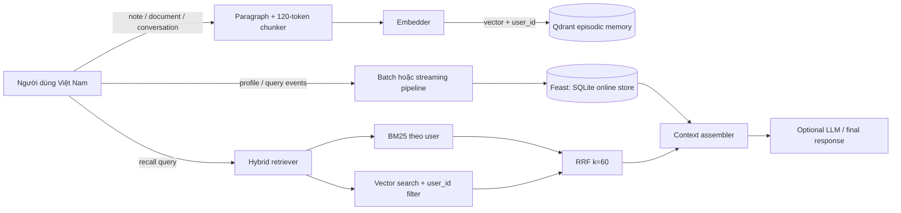

# Hybrid AI Memory cho trợ lý cá nhân Việt Nam

## Mục tiêu và kiến trúc

POC này tách “trí nhớ” thành hai hệ có vòng đời khác nhau. Episodic memory là
nội dung người dùng đã đọc, ghi chú hoặc nói trong hội thoại; nó tăng liên tục
và cần tìm theo ngữ nghĩa nên được lưu ở Qdrant. Stable profile và recent
activity là dữ liệu có schema, cần lookup theo entity và cần tái sử dụng nhất
quán giữa online serving với training nên được quản lý bằng Feast. POC không
gọi LLM thật: nó trả về context đã lắp ráp, chính là input mà một LLM production
sẽ nhận.

Một collection `bonus_memories` được dùng chung cho nhiều user. Mỗi point có
`user_id`, `text`, `created_at` và `chunk_index`; mọi semantic query bắt buộc có
payload filter `user_id`. BM25 cũng chỉ được xây trên các memory của user hiện
tại. Hai ranking được hợp nhất bằng RRF với công thức `1/(60 + rank)`, rank bắt
đầu từ 1. RRF phù hợp vì không cần chuẩn hóa BM25 score với cosine score và vẫn
thưởng mạnh cho memory xuất hiện ở cả hai retriever.

## Quyết định 1 — chiến lược chunking

Tôi chọn paragraph-first, sau đó chia paragraph dài thành cửa sổ tối đa 120
whitespace token và overlap 20 token. Per-message giữ được ranh giới tự nhiên,
nhưng một document được paste vào một message có thể quá dài. Per-conversation
lại gom nhiều ý không liên quan, làm embedding loãng. Semantic chunking có thể
cho retrieval tốt hơn nhưng cần thêm model hoặc thuật toán, làm POC khó giải
thích và tăng latency ingestion.

Mốc 120/20 là thỏa hiệp: chunk nhỏ giúp hit đúng ý hơn và giảm context đưa vào
LLM, nhưng làm tăng số vector và chi phí lưu trữ; chunk lớn rẻ hơn nhưng dễ kéo
theo nội dung thừa. Overlap bảo toàn câu nằm sát biên, đổi lại có thể trả về hai
đoạn gần giống nhau. Production nên đo Recall@K và token/context cost trên dữ
liệu thật trước khi đổi các con số này.

## Quyết định 2 — feature schema

Stable profile dùng các feature dạng bảng: `preferred_language`,
`reading_speed_wpm`, `topic_affinity`, entity `user_id`, source batch và TTL 30
ngày. Recent activity gồm `queries_last_hour` và `distinct_topics_24h`, cùng
entity nhưng TTL 1 giờ. Tabular features dễ quan sát, chỉnh sửa, audit và phục
vụ online hơn một latent profile embedding. Chúng cũng cho phép giải thích rõ
vì sao trợ lý chọn context nào.

Tôi đã cân nhắc lưu toàn bộ episodic vector như embedding feature trong Feast,
nhưng loại bỏ: memory mới có thể đến mỗi phút và cần ANN/re-index, trong khi
profile thay đổi chậm và được lookup bằng entity key. Trộn hai vòng đời khiến
schema, refresh và chi phí vận hành bị gắn chặt không cần thiết. Feast vẫn quan
trọng cho training: historical dataset phải dùng point-in-time join để feature
của tương lai không rò vào một recommendation trong quá khứ.

## Quyết định 3 — freshness

Ba use case có SLA khác nhau. Một note vừa lưu phải recall được ngay, nên
`remember()` embed và upsert đồng bộ, mục tiêu sub-second. Query activity phục
vụ câu “gần đây tôi quan tâm gì?” cần streaming Push API hoặc micro-batch dưới
5 phút; TTL 1 giờ ngăn tín hiệu cũ giả làm sở thích hiện tại. Stable profile
như tốc độ đọc hoặc ngôn ngữ ưu tiên có thể refresh hằng ngày, với TTL 30 ngày,
vì update tức thời không tạo đủ giá trị để bù độ phức tạp. Demo local materialize
SQLite theo batch để tự chạy được; đó là mô phỏng serving contract, không phải
streaming pipeline production.

## Cô lập người dùng và bối cảnh Việt Nam

Tôi đã cân nhắc mỗi user một Qdrant collection nhưng loại bỏ vì số collection,
index và lifecycle job sẽ tăng theo số user. Shared collection + `user_id`
filter đơn giản hơn và vẫn chứng minh isolation ở retrieval. Production cần
payload index, authorization trước query và test chống bỏ quên filter; filter
không thay thế encryption hay access control.

Tiếng Việt thường code-switch như “deploy Kubernetes lên cloud”, nên production
nên dùng embedding multilingual như `multilingual-e5-large` hoặc `bge-m3`.
Fastembed English model được giữ làm default chỉ để lite demo tải nhanh. Split
theo whitespace đủ minh họa nhưng không nhận diện tốt từ ghép tiếng Việt;
`underthesea` hoặc `pyvi` có thể cải thiện BM25, đổi lại thêm dependency và
latency. Typo không dấu và kiểu gõ phonetic cần normalization có đo lường, tránh
“sửa” sai tên riêng. Theo tinh thần Nghị định 13, memory là dữ liệu cá nhân:
cần consent, mục đích sử dụng rõ, khả năng xóa/export và retention policy.

## POC chưa xử lý

POC dùng Qdrant in-memory nên mất episodic memory khi process dừng; chưa có
encryption at rest, authentication, xóa theo yêu cầu, multi-device sync,
deduplication, memory decay hay consolidation. SQLite không đại diện cho tải
đồng thời production. Context assembler chưa chống prompt injection trong tài
liệu và chưa có LLM để đánh giá factuality. Streaming freshness mới được mô tả
ở kiến trúc; demo bootstrap Feast bằng batch materialization để giữ lệnh chạy
độc lập và deterministic.
